# LINQ Zip Operator

## Overview
The Zip operator combines elements from multiple sequences into a single sequence. It uses deferred execution and stops when any sequence ends.

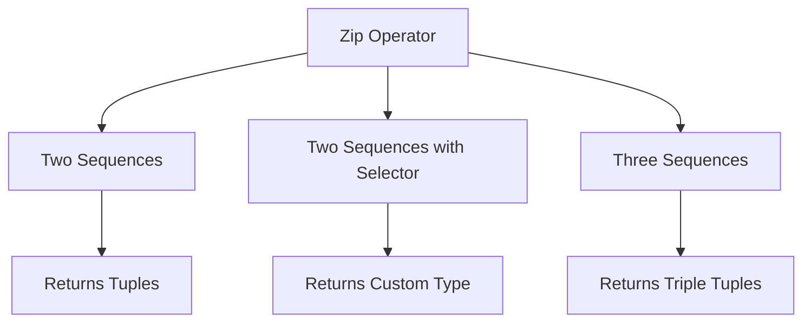

## Sample Data
```csharp
string[] Names = { "Salma", "Aya", "Amr", "Omar" };
int[] Numbers = Enumerable.Range(1, 10).ToArray(); // 1-10
char[] Chars = { 'a', 'b', 'c', 'd', 'e' };
```

## Zip Overloads

### 1. Basic Two Sequence Zip
Combines two sequences into tuples.

```csharp
var Result = Names.Zip(Numbers);

// Output:
foreach (var item in Result)
    Console.WriteLine(item);
/*
(Salma, 1)
(Aya, 2)
(Amr, 3)
(Omar, 4)
*/
```

### 2. Two Sequence Zip with Selector
Combines two sequences using a custom selector function.

```csharp
var Result = Names.Zip(Numbers, (N, Num) => new { 
    Index = Num, 
    Name = N 
});

// Output:
foreach (var item in Result)
    Console.WriteLine($"Index: {item.Index}, Name: {item.Name}");
/*
Index: 1, Name: Salma
Index: 2, Name: Aya
Index: 3, Name: Amr
Index: 4, Name: Omar
*/
```

### 3. Three Sequence Zip
Combines three sequences into triple tuples.

```csharp
var Result = Names.Zip(Numbers, Chars);

// Output:
foreach (var item in Result)
    Console.WriteLine(item);
/*
(Salma, 1, a)
(Aya, 2, b)
(Amr, 3, c)
(Omar, 4, d)
*/
```

## Visual Representation

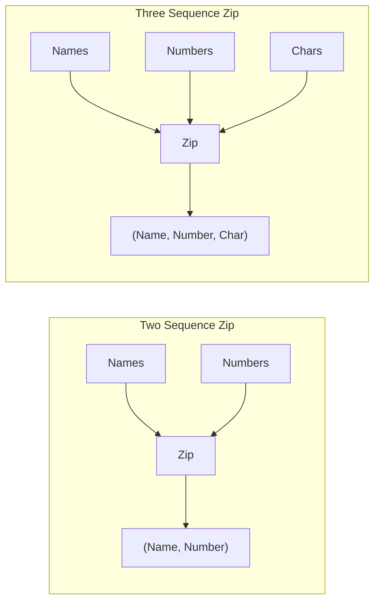

## Key Characteristics

1. **Deferred Execution**
   - Operation is not performed until enumeration
   - Results are generated on-demand

2. **Sequence Length**
   - Stops at the length of shortest sequence
   - Extra elements in longer sequences are ignored

3. **Element Matching**
   - Elements are matched by position
   - Paired in order of occurrence

## Comparison of Overloads

| Overload | Parameters | Return Type | Example |
|----------|------------|-------------|---------|
| Basic | Two sequences | Tuple<T1, T2> | `Names.Zip(Numbers)` |
| With Selector | Two sequences + selector | TResult | `Names.Zip(Numbers, (n, num) => new {...})` |
| Three Sequences | Three sequences | Tuple<T1, T2, T3> | `Names.Zip(Numbers, Chars)` |

## Common Use Cases

1. **Combining Related Data**
```csharp
string[] names = { "John", "Jane" };
int[] ages = { 25, 30 };
var people = names.Zip(ages, (name, age) => 
    new { Name = name, Age = age });
```

2. **Creating Coordinate Pairs**
```csharp
int[] x = { 1, 2, 3 };
int[] y = { 4, 5, 6 };
var points = x.Zip(y, (xVal, yVal) => 
    new { X = xVal, Y = yVal });
```

3. **Combining Multiple Series**
```csharp
string[] dates = { "2024-01", "2024-02" };
int[] sales = { 100, 200 };
int[] targets = { 90, 180 };
var report = dates.Zip(sales, targets);
```

## Best Practices

1. **Handle Different Lengths**
```csharp
// Be aware of sequence lengths
var names = new[] { "A", "B", "C" };
var numbers = new[] { 1, 2 };
var result = names.Zip(numbers); // Only (A,1) and (B,2)
```

2. **Use Type Safety with Selector**
```csharp
// Explicit typing with selector
var typed = Names.Zip(Numbers, (name, num) => 
    new { Name = name, Number = num });
```

3. **Consider Performance**
```csharp
// Cache results if needed multiple times
var zipped = Names.Zip(Numbers).ToList();
```


# LINQ Grouping Operators

## Overview
Grouping operators in LINQ allow you to organize data into groups based on specified keys. These operators use deferred execution.

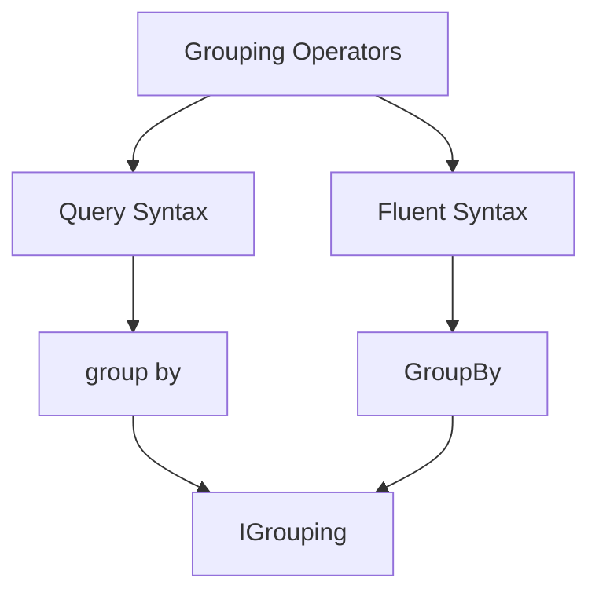

## Basic Structure

The result of grouping is `IEnumerable<IGrouping<TKey,TElement>>` where:
- `TKey`: The type of the grouping key (e.g., string for category)
- `TElement`: The type of elements in each group (e.g., Product)

## Syntax Examples

### 1. Query Syntax
```csharp
// Query syntax (ends with group by)
var Result = from P in ProductList
             group P by P.Category;
```

### 2. Fluent Syntax
```csharp
// Equivalent grouping using fluent syntax
var Result = ProductList.GroupBy(P => P.Category);
```

## Example Output Structure

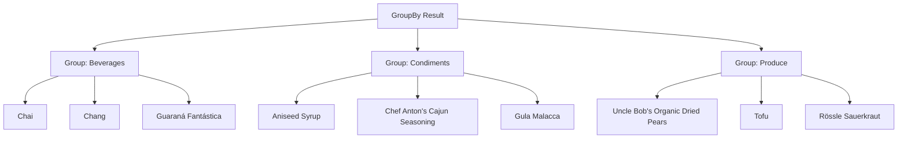

## Displaying Grouped Results

```csharp
foreach (var Category in Result)
{
    // Display category (group key)
    Console.WriteLine(Category.Key);
    
    // Display products in category
    foreach (var Product in Category)
    {
        Console.WriteLine($"                {Product.ProductName}");
    }
}
```

Example Output:
```
Beverages
                Chai
                Chang
                Guaraná Fantástica
                Sasquatch Ale
                Steeleye Stout
Condiments
                Aniseed Syrup
                Chef Anton's Cajun Seasoning
                Chef Anton's Gumbo Mix
                Grandma's Boysenberry Spread
Produce
                Uncle Bob's Organic Dried Pears
                Tofu
                Rössle Sauerkraut
```

## Key Characteristics

1. **Deferred Execution**
   - Grouping is not performed until the results are enumerated
   - Groups are created on-demand

2. **Group Properties**
   - Each group has a `Key` property
   - Each group contains collection of elements
   - Groups implement `IGrouping<TKey,TElement>`

3. **Syntax Options**
   | Feature | Query Syntax | Fluent Syntax |
   |---------|-------------|---------------|
   | Basic Grouping | `group P by P.Category` | `GroupBy(P => P.Category)` |
   | Result Type | IGrouping<TKey,TElement> | IGrouping<TKey,TElement> |
   | Execution | Deferred | Deferred |

## Common Use Cases

1. **Category Organization**
```csharp
var categoryGroups = products.GroupBy(p => p.Category);
```

2. **Price Ranges**
```csharp
var priceRanges = products.GroupBy(p => p.Price switch {
    <= 10 => "Budget",
    <= 50 => "Mid-range",
    _ => "Premium"
});
```

3. **Date-based Grouping**
```csharp
var monthlyGroups = orders.GroupBy(o => o.OrderDate.Month);
```

## Best Practices

1. **Key Selection**
```csharp
// Consider using compound keys
var result = products.GroupBy(p => new { 
    p.Category, 
    p.Supplier 
});
```

2. **Memory Considerations**
```csharp
// For large datasets, consider materializing groups
var groups = result.ToList();
```

3. **Null Handling**
```csharp
// Handle potential null keys
var result = products.GroupBy(p => p.Category ?? "Uncategorized");
```


# Advanced LINQ Grouping with Filtering

## Overview
This example demonstrates how to combine multiple LINQ operations to:
1. Filter products in stock
2. Group them by category
3. Filter groups by size
4. Project results into a custom format

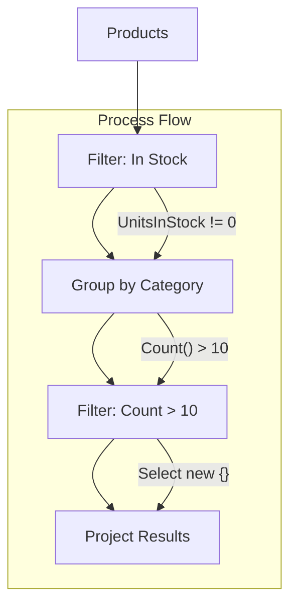

## Basic Group By with Filtering

### Query Syntax - Basic Version
```csharp
var Result = from P in ProductList
             where P.UnitsInStock != 0
             group P by P.Category;

// Display Results
foreach(var Category in Result)
{
    Console.WriteLine(Category.Key);
    foreach(var Product in Category)
    {
        Console.WriteLine($"         {Product.ProductName}");
    }
}
```

## Advanced Grouping with Size Filter

### Query Syntax - Using 'into'
```csharp
var Result = from P in ProductList
             where P.UnitsInStock != 0
             group P by P.Category
             into Category
             where Category.Count() > 10
             select Category;
```

### Query Syntax - With Anonymous Type Projection
```csharp
var Result = from P in ProductList
             where P.UnitsInStock != 0
             group P by P.Category
             into Category
             where Category.Count() > 10
             select new 
             {
                 CategoryName = Category.Key,
                 CountOfProduct = Category.Count()
             };

// Simple display
foreach(var Category in Result)
    Console.WriteLine(Category);
```

### Fluent Syntax - Complete Operation
```csharp
var Result = ProductList
    .Where(P => P.UnitsInStock != 0)
    .GroupBy(P => P.Category)
    .Where(C => C.Count() > 10)
    .Select(C => new 
    {
        CategoryName = C.Key,
        CountOfProduct = C.Count()
    });
```

## Sample Output
```json
{ CategoryName = Beverages, CountOfProduct = 12 }
{ CategoryName = Condiments, CountOfProduct = 11 }
{ CategoryName = Seafood, CountOfProduct = 12 }
{ CategoryName = Confections, CountOfProduct = 13 }
```

## Operation Breakdown

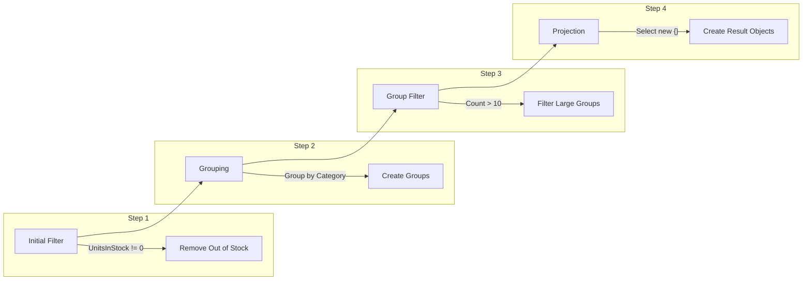

## Comparison of Approaches

| Feature | Query Syntax | Fluent Syntax |
|---------|-------------|---------------|
| Readability | More readable for complex queries | More concise |
| 'into' keyword | Available | Not needed |
| Chaining | Less obvious | More natural |
| Anonymous Types | Similar syntax | Similar syntax |

## Key Points

1. **Operation Order**
   - Filter source data first
   - Group filtered data
   - Filter groups
   - Project results

2. **Performance Considerations**
   ```csharp
   // More efficient: filter before grouping
   .Where(P => P.UnitsInStock != 0)
   .GroupBy(...)
   
   // Less efficient: filter after grouping
   .GroupBy(...)
   .Where(...)
   ```

3. **Memory Usage**
   ```csharp
   // Consider materializing for multiple enumeration
   var materializedResult = Result.ToList();
   ```

## Best Practices

1. **Early Filtering**
```csharp
// Preferred: Filter before grouping
.Where(P => P.UnitsInStock != 0)
.GroupBy(...)

// Avoid: Filtering entire groups
.GroupBy(...)
.Where(g => g.All(p => p.UnitsInStock != 0))
```

2. **Clear Naming**
```csharp
// Use descriptive names in projections
select new 
{
    CategoryName = Category.Key,  // Better than just "Key"
    CountOfProduct = Category.Count()  // Better than just "Count"
};
```

3. **Group Operations**
```csharp
// Additional group operations
.Select(g => new 
{
    CategoryName = g.Key,
    CountOfProduct = g.Count(),
    TotalValue = g.Sum(p => p.UnitPrice * p.UnitsInStock),
    AveragePrice = g.Average(p => p.UnitPrice)
});
```


# LINQ 'into' Keyword

## Overview
The 'into' keyword in LINQ provides query continuation, allowing you to continue querying after grouping, select, or join operations. It's particularly useful in query syntax when you need to perform additional operations on grouped results.

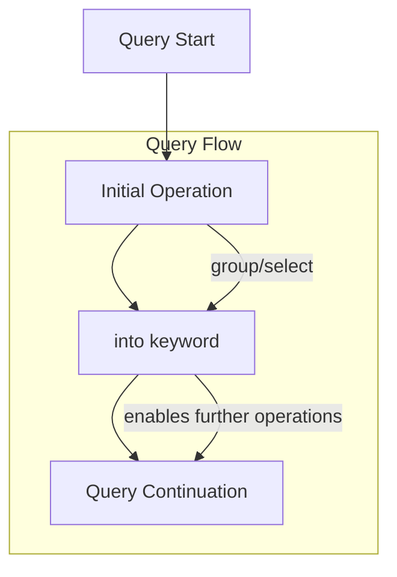

## Basic Usage with GroupBy

### Without 'into' (Basic Grouping)
```csharp
// Basic grouping without continuation
var Result = from P in ProductList
            where P.UnitsInStock != 0
            group P by P.Category;
```

### With 'into' (Query Continuation)
```csharp
// Grouping with continuation using 'into'
var Result = from P in ProductList
            where P.UnitsInStock != 0
            group P by P.Category
            into Category    // Creates new range variable
            where Category.Count() > 10    // Continue querying
            select Category;
```

## Understanding 'into'

### Query Flow Visualization
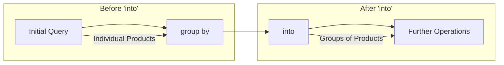

### Common Patterns

1. **Group and Filter**
```csharp
var Result = from P in ProductList
            group P by P.Category
            into Category
            where Category.Count() > 10
            select new 
            {
                CategoryName = Category.Key,
                CountOfProduct = Category.Count()
            };
```

2. **Group and Transform**
```csharp
var Result = from P in ProductList
            group P by P.Category
            into Category
            select new 
            {
                Category = Category.Key,
                Products = Category.ToList(),
                TotalCount = Category.Count()
            };
```

## Example Breakdown

### Step-by-Step Analysis
```csharp
var Result = from P in ProductList        // Start with products
             where P.UnitsInStock != 0    // Filter in-stock items
             group P by P.Category        // Group by category
             into Category                // Continue with groups
             where Category.Count() > 10  // Filter large groups
             select new                   // Project results
             {
                 CategoryName = Category.Key,
                 CountOfProduct = Category.Count()
             };
```

### Process Flow
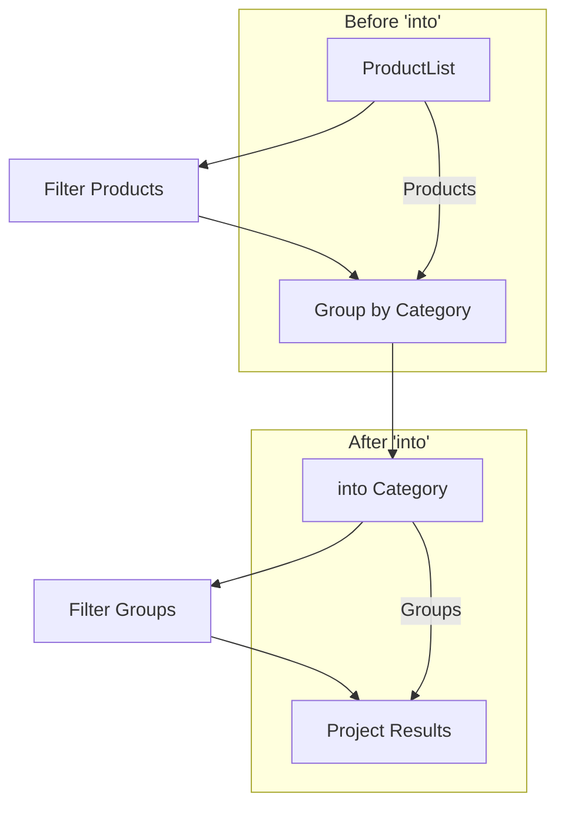

## Comparison: With and Without 'into'

| Feature | Without 'into' | With 'into' |
|---------|---------------|-------------|
| Query Continuation | Not possible | Enabled |
| Group Operations | Limited | Extended |
| Result Access | Direct groups | Filtered/Transformed groups |
| Flexibility | Basic grouping only | Additional operations possible |

## When to Use 'into'

1. **Need to Filter Groups**
```csharp
// Filter groups by size
into Category
where Category.Count() > 10
```

2. **Need Group Calculations**
```csharp
// Perform calculations on groups
into Category
select new 
{
    Name = Category.Key,
    Average = Category.Average(p => p.UnitPrice)
}
```

3. **Need to Transform Groups**
```csharp
// Transform group data
into Category
select new 
{
    Category = Category.Key,
    TopProducts = Category.OrderByDescending(p => p.UnitPrice)
                         .Take(3)
}
```

## Best Practices

1. **Clear Naming**
```csharp
// Use descriptive range variables
group P by P.Category
into categoryGroup  // Clear what this represents
```

2. **Logical Flow**
```csharp
// Organize operations logically
group P by P.Category
into Category
where Category.Count() > 10  // Filter first
orderby Category.Key         // Then sort
select new { ... }          // Finally project
```

3. **Readability**
```csharp
// Break into multiple lines for clarity
group P by P.Category
into Category
where Category.Count() > 10
select new 
{
    Name = Category.Key,
    Count = Category.Count()
};
```

## Sample Output
```json
// Example output from grouped and filtered data
{ CategoryName = Beverages, CountOfProduct = 12 }
{ CategoryName = Condiments, CountOfProduct = 11 }
{ CategoryName = Seafood, CountOfProduct = 12 }
{ CategoryName = Confections, CountOfProduct = 13 }
```
# LINQ Partitioning Operators

## Overview
Partitioning operators in LINQ enable data pagination and sequence splitting. These operators use deferred execution and are essential for implementing pagination and data sampling.

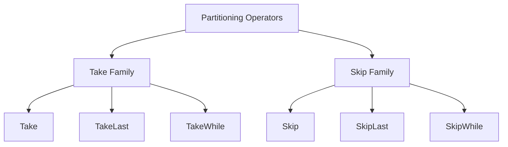

## Available Operators

| Operator | Purpose | Usage |
|----------|---------|-------|
| Take | Get first n elements | `Take(5)` |
| TakeLast | Get last n elements | `TakeLast(5)` |
| Skip | Skip first n elements | `Skip(5)` |
| SkipLast | Skip last n elements | `SkipLast(5)` |
| TakeWhile | Take elements while condition is true | `TakeWhile(predicate)` |
| SkipWhile | Skip elements while condition is true | `SkipWhile(predicate)` |

## Basic Examples

### 1. Take First N Products
```csharp
// Get first 5 products in stock
var Result = ProductList
    .Where(P => P.UnitsInStock != 0)
    .Take(5);

// Sample Output based on data:
// ProductID:1, ProductName:Chai, CategoryBeverages, UnitPrice:18.00, UnitsInStock:100
// ProductID:2, ProductName:Chang, CategoryBeverages, UnitPrice:19.00, UnitsInStock:17
// etc...
```

### 2. Skip N Products
```csharp
// Skip first 5 products in stock
var Result = ProductList
    .Where(P => P.UnitsInStock != 0)
    .Skip(5);
```

### 3. Take Last N Products
```csharp
// Get last 5 products in stock
var Result = ProductList
    .Where(P => P.UnitsInStock != 0)
    .TakeLast(5);
```

### 4. Skip Last N Products
```csharp
// Skip last 5 products
var Result = ProductList
    .Where(P => P.UnitsInStock != 0)
    .SkipLast(5);
```


## Visual Examples

### Take Operation
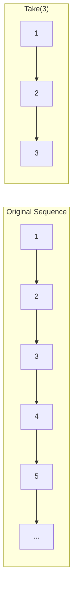

### Skip Operation
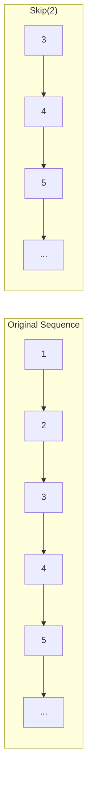

## Common Use Cases

1. **Page Navigation**
```csharp
// Get specific page of data
var pageSize = 10;
var pageNumber = 2;
var pageData = ProductList
    .Skip((pageNumber - 1) * pageSize)
    .Take(pageSize);
```

2. **Data Sampling**
```csharp
// Get first n items for preview
var sample = ProductList
    .Take(5);
```

3. **Windowing**
```csharp
// Get items between positions
var window = ProductList
    .Skip(5)
    .Take(5);
```

## Best Practices

1. **Efficient Filtering**
```csharp
// Filter before pagination
var result = ProductList
    .Where(p => p.UnitsInStock != 0) // Filter first
    .Skip(skip)
    .Take(take);
```

2. **Error Handling**
```csharp
public IEnumerable<Product> GetPage(int pageNumber, int pageSize)
{
    if (pageNumber < 1) pageNumber = 1;
    if (pageSize < 1) pageSize = 10;
    
    return ProductList
        .Skip((pageNumber - 1) * pageSize)
        .Take(pageSize);
}
```

3. **Performance Considerations**
```csharp
// Consider materialization for multiple enumeration
var totalCount = ProductList.Count();
var pageItems = ProductList
    .Skip((pageNumber - 1) * pageSize)
    .Take(pageSize)
    .ToList();
```

# LINQ Conditional Partitioning: TakeWhile and SkipWhile

## Overview
TakeWhile and SkipWhile are conditional partitioning operators that work based on predicates rather than fixed counts. They use deferred execution and stop/start taking elements when their conditions are met.

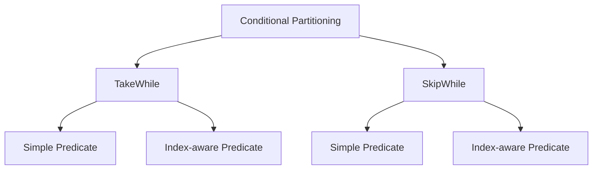

## TakeWhile Operator

### Basic Concept
Takes elements from the sequence as long as the condition is true, stops at the first false condition.

### Example with Index Comparison
```csharp
int[] Numbers = { 5, 4, 6, 5, 8, 7, 1, 2, 1, 9 };
var Result = Numbers.TakeWhile((Num, I) => Num > I);

// Result: 5, 4, 6, 5, 8, 7
// Stops at 1 because 1 is not > index 6
```

### Visual Process
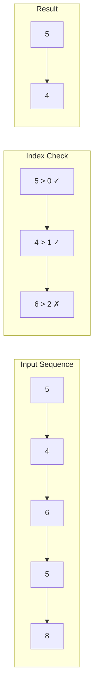

### Overloads
1. Simple Predicate
```csharp
.TakeWhile(num => condition)
```

2. Index-aware Predicate
```csharp
.TakeWhile((num, index) => condition)
```

## SkipWhile Operator

### Basic Concept
Skips elements as long as the condition is true, starts taking elements at the first false condition.

### Example with Modulo Operation
```csharp
int[] Numbers = { 5, 4, 1, 5, 8, 7, 1, 2, 1, 9, 5, 7, 8, 5, 4 };
var Result = Numbers.SkipWhile(Num => Num % 3 != 0);

// Skips numbers until finding one divisible by 3
```

### Visual Process
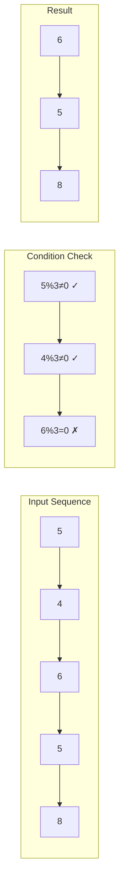

## Comparison of Operators

| Feature | TakeWhile | SkipWhile |
|---------|-----------|-----------|
| Operation | Takes until condition false | Skips until condition false |
| Stopping Point | First false condition | First false condition |
| Index Overload | Yes | Yes |
| Execution | Deferred | Deferred |

## Common Use Cases

### 1. TakeWhile with Index
```csharp
// Take numbers greater than their position
var result = sequence.TakeWhile((num, index) => num > index);
```

### 2. SkipWhile with Condition
```csharp
// Skip until finding a value meeting criteria
var result = sequence.SkipWhile(x => !IsValid(x));
```

## Best Practices

1. **Clear Predicates**
```csharp
// Good: Clear intention
.TakeWhile((num, i) => num > i)

// Avoid: Complex conditions
.TakeWhile((num, i) => num > i && num % 2 == 0 || i < 5)
```

2. **Combining Operations**
```csharp
// Chain with other LINQ operators
var result = numbers
    .Where(n => n > 0)
    .TakeWhile((num, i) => num > i)
    .Select(n => n * 2);
```

3. **Performance Considerations**
```csharp
// Consider materialization for multiple enumeration
var result = numbers
    .TakeWhile((n, i) => n > i)
    .ToList();
```

## Example Output Visualization

For input: `{ 5, 4, 6, 5, 8, 7 }`

TakeWhile (num > index):
```
Index 0: 5 > 0 ✓ (Take 5)
Index 1: 4 > 1 ✓ (Take 4)
Index 2: 6 > 2 ✓ (Take 6)
Index 3: 5 > 3 ✓ (Take 5)
Index 4: 8 > 4 ✓ (Take 8)
Index 5: 7 > 5 ✓ (Take 7)
```

SkipWhile (num % 3 != 0):
```
5 % 3 ≠ 0 ✓ (Skip)
4 % 3 ≠ 0 ✓ (Skip)
6 % 3 = 0 ✗ (Take this and rest)
```


# LINQ Query Continuation with let and into

## Overview
Query continuation in LINQ allows you to continue processing results using the 'into' keyword. This feature is only available in query syntax and is particularly useful for complex transformations.

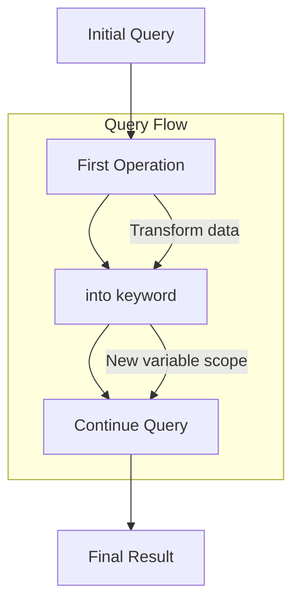

## Basic Setup
```csharp
using System.Text.RegularExpressions;

List<string> Names = new List<string>() 
{
    "Omar",
    "Ali",
    "Sally",
    "Mohamed",
    "Ahmed"
};
```

## Simple Vowel Removal

### Basic Query
```csharp
// Remove vowels using regex
var Result = from N in Names
            select Regex.Replace(N, "[AOUIEaouie]", string.Empty);

// Display results
foreach(var name in Result)
    Console.WriteLine(name);

/* Output:
mr
l
slly
Mhmd
hmd
*/
```

## Advanced Query with Continuation

### Using 'into' for Further Processing
```csharp
var Result = from N in Names
             select Regex.Replace(N, "[AOUIEaouie]", string.Empty)
             into NoVowelNames
             where NoVowelNames.Length > 3
             select NoVowelNames;

/* Output:
Slly
Mhmd
*/
```

## Query Breakdown

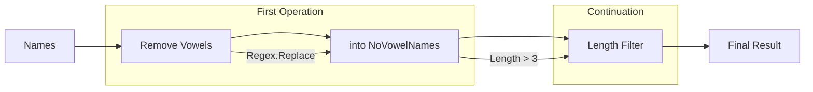

## Understanding Query Continuation

### 1. Initial Query
```csharp
from N in Names
select Regex.Replace(N, "[AOUIEaouie]", string.Empty)
```

### 2. Continuation with 'into'
```csharp
into NoVowelNames  // Creates new range variable
```

### 3. Additional Processing
```csharp
where NoVowelNames.Length > 3
select NoVowelNames
```

## Key Points

| Feature | Description | Example |
|---------|-------------|---------|
| Query Syntax Only | Not available in fluent syntax | `from ... into ...` |
| Range Variable | Creates new scope | `into NoVowelNames` |
| Continuation | Enables further processing | `where NoVowelNames.Length > 3` |

## Regular Expression Details

```csharp
Regex.Replace(
    input: N,                    // Input string
    pattern: "[AOUIEaouie]",     // Vowel pattern
    replacement: string.Empty     // Remove vowels
)
```

## Best Practices

1. **Clear Naming**
```csharp
// Good
into processedNames

// Avoid
into x
```

2. **Logical Flow**
```csharp
// Transform first, then filter
select Regex.Replace(...)
into processed
where processed.Length > 3
```

3. **Readability**
```csharp
var Result = from N in Names
             select Regex.Replace(N, "[AOUIEaouie]", string.Empty)
             into NoVowelNames
             where NoVowelNames.Length > 3
             select NoVowelNames;
```

## Process Flow Visualization

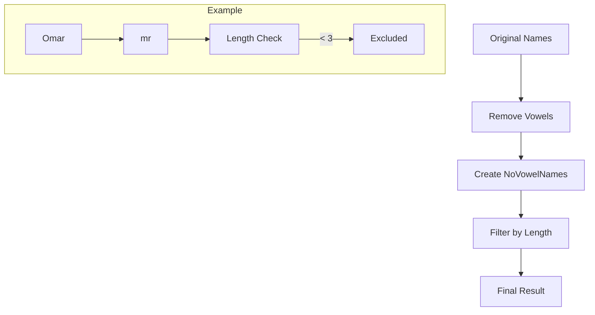

## Query Steps Explained

1. **Initial Data**
   - List of names (Omar, Ali, Sally, Mohamed, Ahmed)

2. **First Transformation**
   - Remove vowels using Regex
   - Creates intermediate results (mr, l, slly, Mhmd, hmd)

3. **Query Continuation**
   - New range variable for processed names
   - Filter by length > 3
   - Final results (Slly, Mhmd)


# LINQ: let vs into Keywords

## Overview
While both 'let' and 'into' allow query continuation, they work differently:
- 'let' adds a new range variable alongside existing ones
- 'into' restarts the query with a new range variable

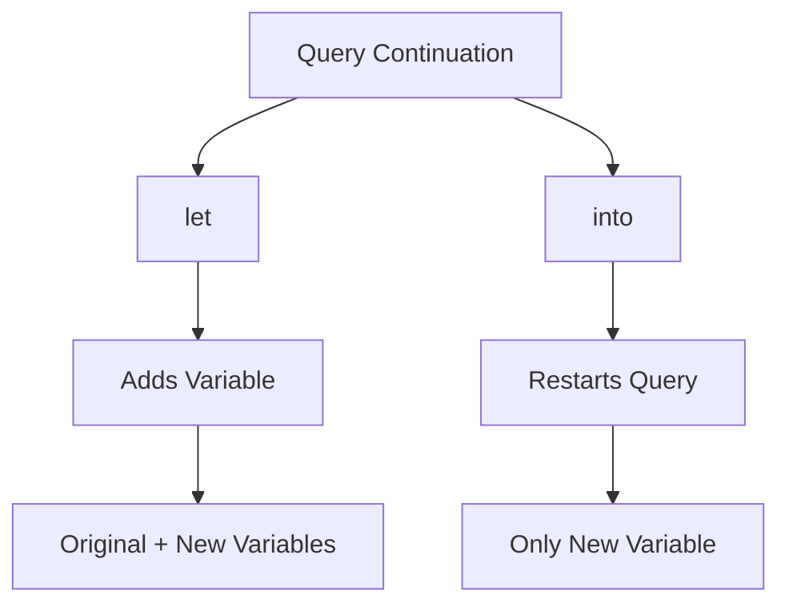

## Comparing Approaches

### Using 'into'
```csharp
var Result = from N in Names
             select Regex.Replace(N, "[AOUIEaouie]", string.Empty)
             into NoVowelNames
             where NoVowelNames.Length > 3
             select NoVowelNames;
```

### Using 'let'
```csharp
var Result = from N in Names
             let NoVowelNames = Regex.Replace(N, "[AOUIEaouie]", string.Empty)
             where NoVowelNames.Length > 3
             select NoVowelNames;
```

## Key Differences

| Feature | let | into |
|---------|-----|------|
| Query Continuation | Continues with all variables | Restarts with new variable |
| Original Variable | Still accessible | No longer accessible |
| Scope | Adds to current scope | Creates new scope |
| Usage | Complex transformations | Query separation |

## Visual Representation

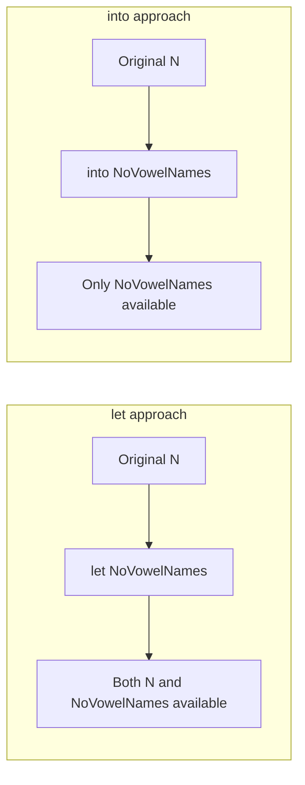

## Advanced Examples

### Using 'let' with Multiple Transformations
```csharp
var Result = from N in Names
             let NoVowelNames = Regex.Replace(N, "[AOUIEaouie]", string.Empty)
             let Length = NoVowelNames.Length
             where Length > 3
             select new { Original = N, Processed = NoVowelNames, Length };
```

### Access to Original Values
```csharp
// With 'let' - can access both original and transformed
var Result = from N in Names
             let NoVowelNames = Regex.Replace(N, "[AOUIEaouie]", string.Empty)
             where NoVowelNames.Length > 3
             select new { 
                 Original = N,
                 Transformed = NoVowelNames 
             };

// With 'into' - can only access transformed
var Result = from N in Names
             select Regex.Replace(N, "[AOUIEaouie]", string.Empty)
             into NoVowelNames
             where NoVowelNames.Length > 3
             select NoVowelNames;
```

## When to Use Each

### Use 'let' when:
1. You need access to original variables
2. Performing multiple transformations
3. Building complex objects using both original and transformed data

```csharp
from N in Names
let processed = Regex.Replace(N, "[AOUIEaouie]", string.Empty)
select new { 
    Original = N, 
    Processed = processed,
    Length = processed.Length 
}
```

### Use 'into' when:
1. You want to start fresh with new variable
2. Original values aren't needed anymore
3. Creating clear separation in query logic

```csharp
from N in Names
select Regex.Replace(N, "[AOUIEaouie]", string.Empty)
into processed
where processed.Length > 3
select processed
```

## Best Practices

1. **Choose Based on Needs**
```csharp
// Use 'let' when needing original data
let processed = transformation
select new { Original, Processed }

// Use 'into' when only needing transformed data
into processed
select processed
```

2. **Clear Naming**
```csharp
// Descriptive variable names
let noVowelName = Regex.Replace(...)
let nameLength = noVowelName.Length
```

3. **Query Readability**
```csharp
// Break complex transformations into steps
let cleaned = Regex.Replace(...)
let processed = cleaned.ToLower()
let length = processed.Length
```
