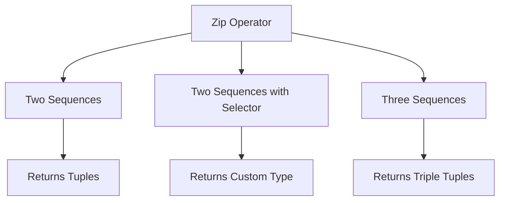
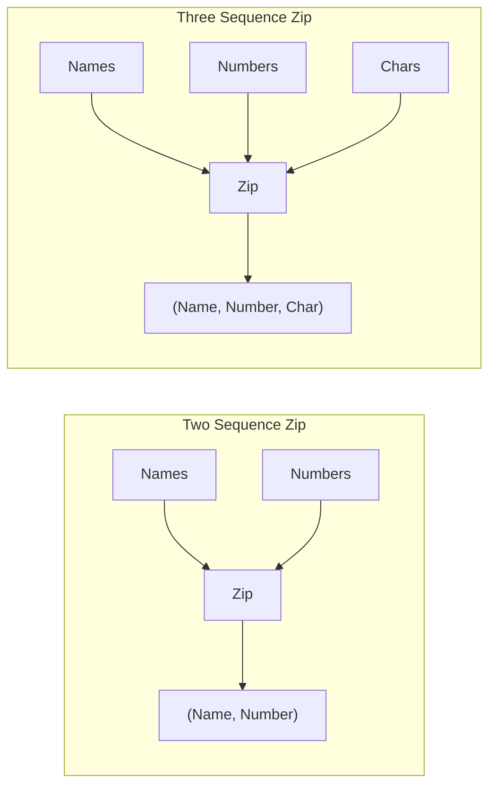

# LINQ Zip Operator

## Overview
The Zip operator combines elements from multiple sequences into a single sequence. It uses deferred execution and stops when any sequence ends.



## Sample Data
```csharp
string[] Names = { "Salma", "Aya", "Amr", "Omar" };
int[] Numbers = Enumerable.Range(1, 10).ToArray(); // 1-10
char[] Chars = { 'a', 'b', 'c', 'd', 'e' };
```

## Zip Overloads

### 1. Basic Two Sequence Zip
Combines two sequences into tuples.

```csharp
var Result = Names.Zip(Numbers);

// Output:
foreach (var item in Result)
    Console.WriteLine(item);
/*
(Salma, 1)
(Aya, 2)
(Amr, 3)
(Omar, 4)
*/
```

### 2. Two Sequence Zip with Selector
Combines two sequences using a custom selector function.

```csharp
var Result = Names.Zip(Numbers, (N, Num) => new { 
    Index = Num, 
    Name = N 
});

// Output:
foreach (var item in Result)
    Console.WriteLine($"Index: {item.Index}, Name: {item.Name}");
/*
Index: 1, Name: Salma
Index: 2, Name: Aya
Index: 3, Name: Amr
Index: 4, Name: Omar
*/
```

### 3. Three Sequence Zip
Combines three sequences into triple tuples.

```csharp
var Result = Names.Zip(Numbers, Chars);

// Output:
foreach (var item in Result)
    Console.WriteLine(item);
/*
(Salma, 1, a)
(Aya, 2, b)
(Amr, 3, c)
(Omar, 4, d)
*/
```

## Visual Representation



## Key Characteristics

1. **Deferred Execution**
   - Operation is not performed until enumeration
   - Results are generated on-demand

2. **Sequence Length**
   - Stops at the length of shortest sequence
   - Extra elements in longer sequences are ignored

3. **Element Matching**
   - Elements are matched by position
   - Paired in order of occurrence

## Comparison of Overloads

| Overload | Parameters | Return Type | Example |
|----------|------------|-------------|---------|
| Basic | Two sequences | Tuple<T1, T2> | `Names.Zip(Numbers)` |
| With Selector | Two sequences + selector | TResult | `Names.Zip(Numbers, (n, num) => new {...})` |
| Three Sequences | Three sequences | Tuple<T1, T2, T3> | `Names.Zip(Numbers, Chars)` |

## Common Use Cases

1. **Combining Related Data**
```csharp
string[] names = { "John", "Jane" };
int[] ages = { 25, 30 };
var people = names.Zip(ages, (name, age) => 
    new { Name = name, Age = age });
```

2. **Creating Coordinate Pairs**
```csharp
int[] x = { 1, 2, 3 };
int[] y = { 4, 5, 6 };
var points = x.Zip(y, (xVal, yVal) => 
    new { X = xVal, Y = yVal });
```

3. **Combining Multiple Series**
```csharp
string[] dates = { "2024-01", "2024-02" };
int[] sales = { 100, 200 };
int[] targets = { 90, 180 };
var report = dates.Zip(sales, targets);
```

## Best Practices

1. **Handle Different Lengths**
```csharp
// Be aware of sequence lengths
var names = new[] { "A", "B", "C" };
var numbers = new[] { 1, 2 };
var result = names.Zip(numbers); // Only (A,1) and (B,2)
```

2. **Use Type Safety with Selector**
```csharp
// Explicit typing with selector
var typed = Names.Zip(Numbers, (name, num) => 
    new { Name = name, Number = num });
```

3. **Consider Performance**
```csharp
// Cache results if needed multiple times
var zipped = Names.Zip(Numbers).ToList();
```
